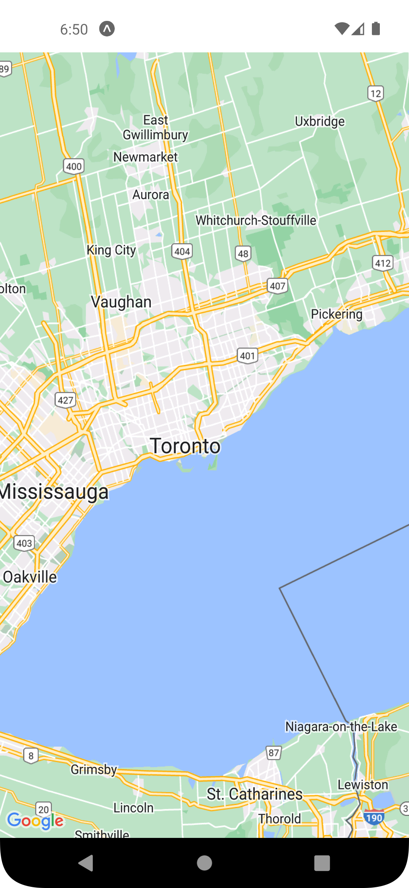

# React-Native-Map-App
React Native map components for iOS and Android

### HOW TO RUN:
```console
npm install
npx expo start
```

### DESCRIPTIONS:
1. The map starts with the **initial region**.
2. The user can do **zoom in**, **zoom out** or **another place**.

### SCREENSHOTS:
<kbd></kbd>
